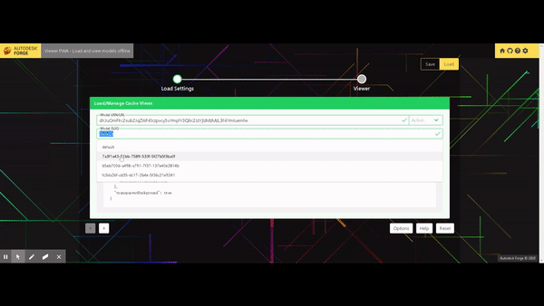
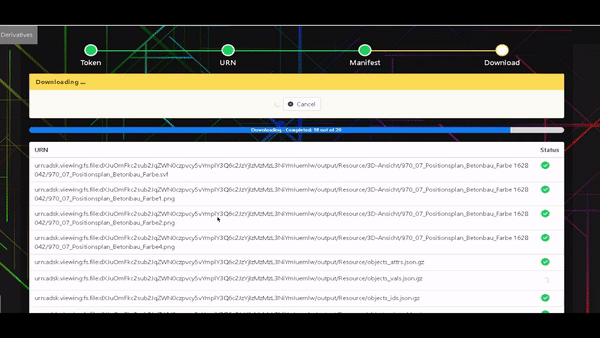

[](https://travis-ci.org/dukedhx/forge-tools-hub)
[](http://opensource.org/licenses/MIT)
[](https://github.com/standard/standard)
[](https://forge.autodesk.com/)

## Links:

- Production: https://forge-tools-hub.now.sh/
- Playground: https://codesandbox.io/s/github/dukedhx/forge-tools-hub/tree/master
- Code: https://github.com/dukedhx/forge-tools-hub/
- Blog: https://forge.autodesk.com/blog/meet-forge-tools-hub-jamstackserverless-tools-download-derivatives-svf-and-view-models-offline
- Other Intructions: https://hackmd.io/RRLAzAgURHCBE5RMN3ZfZA

## Description

A curated collection of Forge tools with boilerplate code to build SSR Forge apps:

- SVF Saver: Download SVF files for an extracted model from Forge with Service Worker capturing the derivatives as Viewer renders the model- Downloader: Download a derivative or any web resource in chunks (so the request won't get timed out) and in parallel for better efficiency- HTTP Requester: Effortlessly make any (browser supported) HTTP requests to execute simple tasks like access tokens, model translation etc - Derivative Downloader: Parse a derivative manifest for an extracted model on Forge and download selected derivatives (SVF or other supported formats)
- PWA: Cache and view models offline - PWA ready
- Uploader: Upload an object in paralleled chunks - requires the recipient service to explicitly expose forbidden headers if needed
- Viewer Options Generator: Generate all possibile Viewer init/load options such as transform metrics easily ...
- Tutorial/Playground: Curated collection of interactive Forge tutorials & playgrounds

You may also find sample code here to:

- Develop Forge Viewer apps with Vue 
- Advanced usage of Workbox
- Download SVF derivatives

## Prerequisites

- Install [Node.js](https://nodejs.org/en/download/)

## Demo





## Running Locally

- clone this project
- `npm install`
- `npm run dev`

## SSR

- `npm run generate`

## Project Structure

```
|
|- assets 
|- components     // Vue and JS components
|- layouts	      // Nuxt layout views
|- middleware	    
|- pages	        // Vue Viewes
|- plugins	      // Service worker and lazy load plugin
|- server
|- static
|- store          // Vuex store
```


## License

[MIT](http://opensource.org/licenses/MIT)

## Written By

[Bryan Huang](https://www.linkedin.com/in/bryan-huang-1447b862) - Forge Partner Development https://forge.autodesk.com
